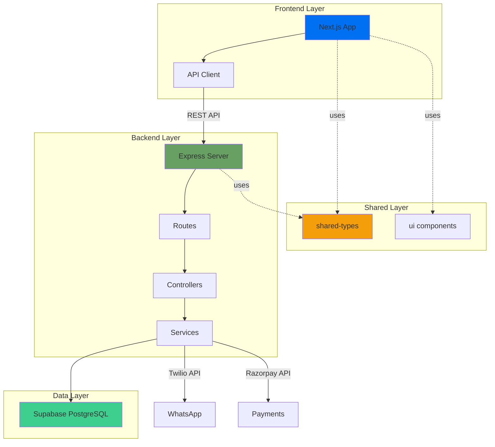
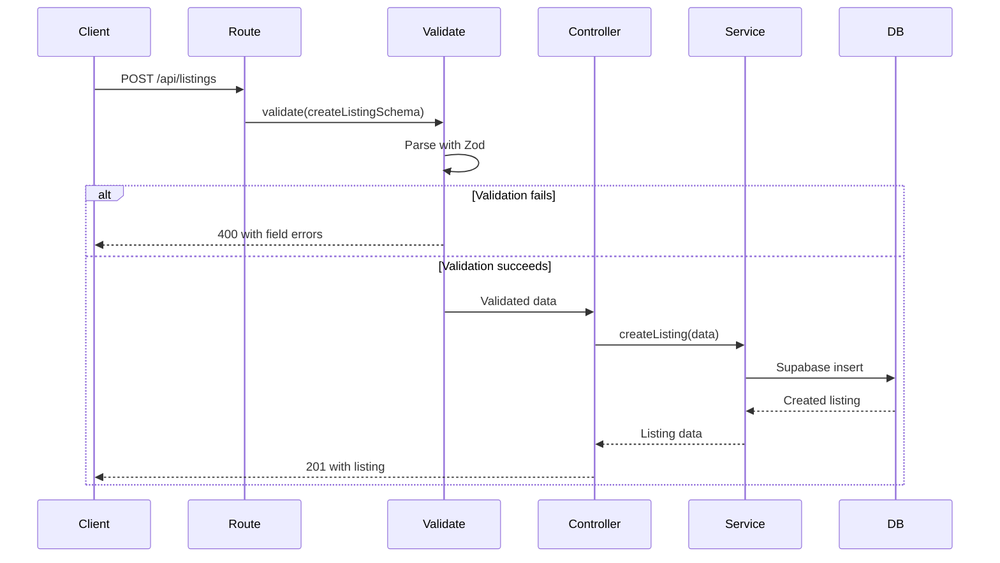

## Overview

Propery Connect is built as a **Turborepo monorepo** with clear separation of concerns. This architecture enables code sharing, consistent tooling, and independent deployment of services.



## Monorepo Structure

<CodeGroup>
  ```plaintext Project Tree propery-connect/ ├── apps/ │ ├── web/ # Next.js 14 frontend │ ├── api/ #
  Express.js backend │ └── docs/ # Mintlify documentation ├── packages/ │ ├── shared-types/ # Shared
  TypeScript types & Zod schemas │ ├── ui/ # Reusable React components │ ├── typescript-config/#
  Shared TypeScript configs │ └── eslint-config/ # Shared ESLint rules ├── supabase/ │ └──
  migrations/ # Database schema migrations └── turbo.json # Turborepo configuration ```
</CodeGroup>

### Key Principles

<AccordionGroup>
  <Accordion icon="link" title="Single Source of Truth">
    Types and validation schemas are defined **once** in `packages/shared-types` and imported by all apps. This ensures:
    - Type safety across frontend and backend
    - Consistent validation rules
    - Automatic synchronization of data contracts
  </Accordion>

<Accordion icon="layer-group" title="Layered Architecture">
  The backend follows a strict layered pattern: 1. **Routes** - Define endpoints and attach
  middleware 2. **Controllers** - Handle HTTP requests/responses 3. **Services** - Contain business
  logic and data access 4. **Config** - Pre-configured third-party clients
</Accordion>

  <Accordion icon="arrows-rotate" title="Build Optimization">
    Turborepo intelligently caches builds and only rebuilds what changed:
    - Shared packages build before apps (dependency graph)
    - Parallel execution where possible
    - Persistent local caching
  </Accordion>
</AccordionGroup>

## Frontend Architecture

### Next.js 14 App Router

The frontend uses Next.js 14's App Router with React Server Components:

```
apps/web/src/
├── app/
│   ├── layout.tsx        # Root layout with providers
│   ├── page.tsx          # Home page (Server Component)
│   └── globals.css       # Tailwind styles
├── components/
│   ├── forms/            # Form components with validation
│   └── ui/               # Basic UI components
├── lib/
│   ├── api/              # API client wrapper
│   │   ├── client.ts     # Fetch wrapper with error handling
│   │   ├── auth.ts       # Auth API calls
│   │   ├── listings.ts   # Listings API calls
│   │   └── payments.ts   # Payments API calls
│   └── supabase/
│       └── client.ts     # Supabase client for real-time features
└── providers/
    └── index.tsx         # React Context providers
```

### API Client Pattern

All API calls go through a standardized client (`apps/web/src/lib/api/client.ts`):

```typescript
// Automatic JSON parsing, error handling, and auth headers
const listings = await api.get<ListingsResponse>('/listings');
await api.post('/listings', createData);
```

<Note>
  The frontend **never** accesses the database directly. All data flows through the REST API.
</Note>

## Backend Architecture

### Express.js Service Layer

The backend enforces a service-oriented architecture:

```
apps/api/src/
├── config/               # Pre-configured clients
│   ├── env.ts           # Zod-validated environment
│   ├── supabase.ts      # Supabase client instance
│   ├── twilio.ts        # Twilio client instance
│   └── razorpay.ts      # Razorpay client instance
├── routes/              # Route definitions
│   ├── index.ts         # Route aggregator
│   ├── auth.routes.ts   # Auth endpoints
│   ├── listings.routes.ts
│   ├── payments.routes.ts
│   └── whatsapp.routes.ts
├── controllers/         # HTTP request handlers
├── services/            # Business logic & data access
├── middleware/
│   ├── auth.ts          # JWT authentication
│   ├── validate.ts      # Zod request validation
│   ├── error-handler.ts # Global error handling
│   └── rate-limit.ts    # Rate limiting
└── utils/
    ├── response.ts      # Standardized responses
    └── logger.ts        # Structured logging
```

### Middleware Stack Order

<Warning>
  Middleware order is **critical**. The `errorHandler` must always be registered last.
</Warning>

```typescript
// apps/api/src/index.ts
app.use(helmet()); // 1. Security headers
app.use(cors()); // 2. CORS configuration
app.use(express.json()); // 3. Body parsing
app.use(requestLogger); // 4. Request logging
app.use('/api', apiRoutes); // 5. Route handlers
app.use(errorHandler); // 6. Error handling (MUST BE LAST)
```

## Data Flow

### Request Validation Flow



### Type Safety Chain

<Steps>
  <Step title="Define Schema">
    Zod schema in `packages/shared-types/src/validations/listing.ts`:
    ```typescript
    export const createListingSchema = z.object({
      title: z.string().min(5).max(200),
      price: z.number().positive(),
      // ...
    });
    ```
  </Step>

  <Step title="Infer TypeScript Type">
    TypeScript type automatically derived:
    ```typescript
    export type CreateListingInput = z.infer<typeof createListingSchema>;
    ```
  </Step>

<Step title="Use in Backend">
  Validation middleware ensures type safety: ```typescript router.post('/',
  validate(createListingSchema), createListing); ```
</Step>

  <Step title="Use in Frontend">
    React Hook Form uses the same schema:
    ```typescript
    const form = useForm<CreateListingInput>({
      resolver: zodResolver(createListingSchema)
    });
    ```
  </Step>
</Steps>

## Database Architecture

### Supabase with Row-Level Security

The database uses PostgreSQL with Row-Level Security (RLS) policies:

<CardGroup cols={2}>
  <Card title="users" icon="user">
    User profiles with phone/email authentication
  </Card>
  <Card title="listings" icon="house">
    Property listings with category and location
  </Card>
  <Card title="tokens" icon="key">
    Authentication tokens with expiration
  </Card>
  <Card title="payments" icon="credit-card">
    Razorpay payment records
  </Card>
  <Card title="messages" icon="message">
    WhatsApp message logs via Twilio
  </Card>
</CardGroup>

### RLS Policy Pattern

```sql
-- Listings are publicly readable
CREATE POLICY "listings_select"
ON listings FOR SELECT
USING (true);

-- Users can only modify their own listings
CREATE POLICY "listings_update"
ON listings FOR UPDATE
USING (auth.uid() = user_id);
```

<Tip>
  RLS policies enforce data access control at the database level, providing defense-in-depth
  security.
</Tip>

## Integration Points

### Third-Party Services

<CardGroup cols={3}>
  <Card title="Supabase" icon="database">
    PostgreSQL database with real-time subscriptions and authentication
  </Card>
  <Card title="Twilio" icon="message">
    WhatsApp Business API for direct messaging between users
  </Card>
  <Card title="Razorpay" icon="indian-rupee-sign">
    Payment gateway for processing listing fees and premium features
  </Card>
</CardGroup>

All third-party clients are pre-configured in `apps/api/src/config/` and should never be instantiated directly:

```typescript
// ✅ Correct
import supabase from '@/config/supabase';
import twilioClient from '@/config/twilio';

// ❌ Wrong - don't instantiate clients in services
import { createClient } from '@supabase/supabase-js';
const supabase = createClient(...);
```

## Deployment Architecture

<Info>
  Each app can be deployed independently while sharing the same type definitions from
  `packages/shared-types`.
</Info>

### Recommended Setup

- **Frontend**: Vercel (automatic Next.js optimization)
- **Backend**: Railway, Render, or Fly.io
- **Database**: Supabase (managed PostgreSQL)
- **Documentation**: Mintlify (automatic deployment from repo)

## Performance Considerations

### Turborepo Caching

Turborepo caches task outputs based on inputs:

```json
// turbo.json
{
  "tasks": {
    "build": {
      "dependsOn": ["^build"], // Build dependencies first
      "outputs": [".next/**", "dist/**"],
      "cache": true // Cache build outputs
    }
  }
}
```

### Next.js Optimizations

- Server Components for reduced client-side JavaScript
- Automatic code splitting per route
- Image optimization with `next/image`
- Static generation where possible

## Security Architecture

<AccordionGroup>
  <Accordion icon="shield" title="Environment Validation">
    The backend validates all environment variables at startup using Zod. If any required variable is missing, the process exits immediately, preventing deployment with incomplete configuration.
  </Accordion>

<Accordion icon="shield" title="Database RLS">
  Row-Level Security policies enforce access control at the database level, preventing unauthorized
  access even if application-level checks fail.
</Accordion>

<Accordion icon="shield" title="CORS Configuration">
  The backend enforces CORS with explicit origin whitelisting, preventing cross-origin attacks from
  unauthorized domains.
</Accordion>

  <Accordion icon="shield" title="Security Headers">
    Helmet middleware adds security headers (CSP, HSTS, etc.) to all responses, protecting against common web vulnerabilities.
  </Accordion>
</AccordionGroup>

## Next Steps

<CardGroup cols={2}>
  <Card title="Development Setup" icon="code" href="/development/setup">
    Learn how to set up your local development environment
  </Card>
  <Card title="Code Patterns" icon="book" href="/development/patterns">
    Discover the conventions used throughout the codebase
  </Card>
  <Card title="Database Schema" icon="database" href="/development/database">
    Explore the complete database schema and migrations
  </Card>
  <Card title="API Reference" icon="webhook" href="/api-reference/introduction">
    Browse all available API endpoints
  </Card>
</CardGroup>
