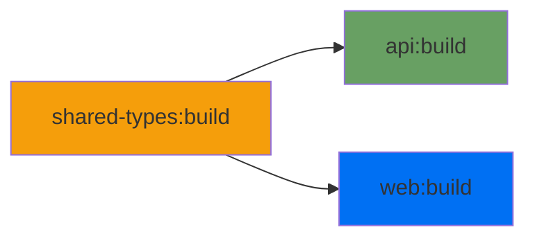

## Understanding Workspaces

The monorepo uses npm workspaces to manage multiple packages:

```json
// Root package.json
{
  "workspaces": ["apps/*", "packages/*"]
}
```

Each workspace is an independent package with its own `package.json`.

## Adding Dependencies

<Tabs>
  <Tab title="To Specific Workspace">
    ```bash
    # Add to backend
    npm install express --workspace=@propery-connect/api

    # Add dev dependency to frontend
    npm install -D @types/node --workspace=@propery-connect/web
    ```

  </Tab>

<Tab title="To Root">```bash # Add to root (for all workspaces) npm install -D prettier ```</Tab>

  <Tab title="To All Workspaces">
    ```bash
    # Install in all workspaces
    npm install zod --workspaces
    ```
  </Tab>
</Tabs>

## Workspace Dependencies

Workspaces can depend on each other:

```json
// apps/api/package.json
{
  "dependencies": {
    "@propery-connect/shared-types": "*"
  }
}
```

<Note>
  Use `"*"` as the version for local workspace dependencies. This tells npm to always use the local
  version.
</Note>

## Running Scripts

<CodeGroup>
```bash All Workspaces
# Run dev script in all workspaces
npm run dev

# Run build in all workspaces

npm run build

````

```bash Specific Workspace
# Run in one workspace
npm run dev --workspace=@propery-connect/api

# Multiple workspaces
npm run build --workspace=@propery-connect/web --workspace=@propery-connect/api
````

</CodeGroup>

## Turborepo Task Pipeline

Turborepo orchestrates task execution based on `turbo.json`:

```json
{
  "tasks": {
    "build": {
      "dependsOn": ["^build"], // Build dependencies first
      "outputs": [".next/**", "dist/**"],
      "cache": true
    }
  }
}
```

### Task Dependencies

The `^` prefix means "dependencies' tasks must run first":



## Caching Strategy

Turborepo caches task outputs to speed up repeated builds:

<AccordionGroup>
  <Accordion icon="bolt" title="What Gets Cached?">
    - Build outputs (dist/, .next/)
    - Type-check results
    - Lint results
  </Accordion>

<Accordion icon="key" title="Cache Keys">
  Cache is invalidated when: - Source files change - Dependencies change - Environment variables
  change
</Accordion>

  <Accordion icon="trash" title="Clearing Cache">
    ```bash
    # Force rebuild without cache
    npx turbo build --force

    # Clear cache directory
    rm -rf node_modules/.cache/turbo
    ```

  </Accordion>
</AccordionGroup>

## Best Practices

<CardGroup cols={2}>
  <Card title="Use Workspaces" icon="box">
    Always reference internal packages using workspace protocol (`@propery-connect/shared-types`)
  </Card>
  <Card title="Build Dependencies" icon="layer-group">
    Shared packages must be built before apps can use them
  </Card>
  <Card title="Avoid Duplication" icon="copy">
    Put shared code in `packages/` instead of duplicating across apps
  </Card>
  <Card title="Parallel Execution" icon="gauge-high">
    Turborepo runs independent tasks in parallel for faster builds
  </Card>
</CardGroup>

## Adding a New Workspace

<Steps>
  <Step title="Create Directory">
    ```bash
    mkdir -p packages/new-package
    cd packages/new-package
    ```
  </Step>

  <Step title="Initialize Package">
    Create `package.json`:
    ```json
    {
      "name": "@propery-connect/new-package",
      "version": "0.0.1",
      "private": true,
      "main": "./src/index.ts"
    }
    ```
  </Step>

<Step title="Add to Workspaces">
  The root `package.json` already includes `packages/*`, so it's automatically detected.
</Step>

  <Step title="Install Dependencies">
    ```bash
    # From root
    npm install
    ```
  </Step>
</Steps>

## Next Steps

<CardGroup cols={2}>
  <Card title="Development Setup" icon="terminal" href="/development/setup">
    Learn about running the development environment
  </Card>
  <Card title="Code Patterns" icon="book" href="/development/patterns">
    Understand the conventions used in the codebase
  </Card>
</CardGroup>
